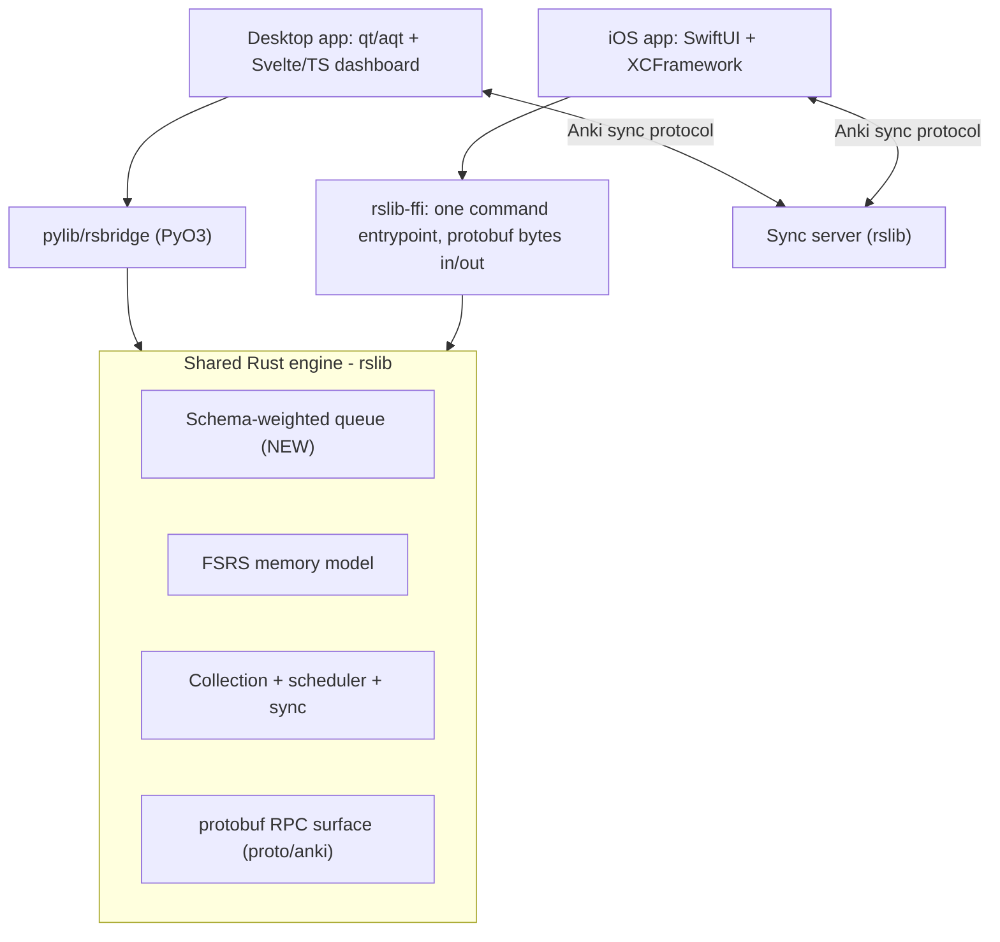
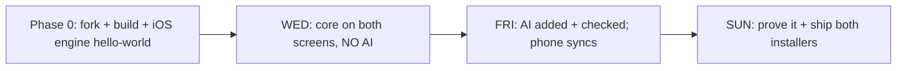

# Speedrun LSAT — Product Requirements Document

**Exam: LSAT (Law School Admission Test), scored 120–180.**
**License: AGPL-3.0-or-later, forked from [Anki](https://github.com/ankitects/anki) with attribution. Some Anki components are BSD-3-Clause.**

> A desktop app and an iOS companion that share one Rust engine, measure three different things (memory, performance, readiness), make a real change inside Anki's Rust core, and back up every number they show.

This PRD is the single source of truth for the build. It encodes both the Speedrun specification and the learning science in the LSAT BrainLift. The phased roadmap in [§16](#16-deadline-aligned-roadmap) maps every requirement to the Wednesday / Friday / Sunday deadlines.

Companion documents:
- [docs/architecture.md](docs/architecture.md) — system architecture and the shared-engine design.
- [docs/roadmap.md](docs/roadmap.md) — the deadline-by-deadline execution checklist with proof artifacts.
- [docs/models/memory-model.md](docs/models/memory-model.md), [docs/models/performance-model.md](docs/models/performance-model.md), [docs/models/readiness-model.md](docs/models/readiness-model.md) — one-page model descriptions (to be filled with real numbers as the build progresses).

---

## Table of contents
1. [Mission and the honesty rule](#1-mission-and-the-honesty-rule)
2. [Product thesis (from the BrainLift)](#2-product-thesis-from-the-brainlift)
3. [Spiky POVs mapped to product requirements](#3-spiky-povs-mapped-to-product-requirements)
4. [Users and scope](#4-users-and-scope)
5. [The LSAT, modeled as it works today](#5-the-lsat-modeled-as-it-works-today)
6. [Architecture: two apps, one engine](#6-architecture-two-apps-one-engine)
7. [Phase 0: fork, build, and toolchain](#7-phase-0-fork-build-and-toolchain)
8. [Schema taxonomy, data model, and coverage map](#8-schema-taxonomy-data-model-and-coverage-map)
9. [The Rust change: schema-weighted points-at-stake queue](#9-the-rust-change-schema-weighted-points-at-stake-queue)
10. [The three scores](#10-the-three-scores)
11. [Desktop app: review loop and dashboard](#11-desktop-app-review-loop-and-dashboard)
12. [iOS companion: the engine on the phone](#12-ios-companion-the-engine-on-the-phone)
13. [Sync and the conflict rule](#13-sync-and-the-conflict-rule)
14. [AI features: sourced, evaluated, switch-off-able](#14-ai-features-sourced-evaluated-switch-off-able)
15. [Study-feature experiment: interleaving](#15-study-feature-experiment-interleaving)
16. [Deadline-aligned roadmap](#16-deadline-aligned-roadmap)
17. [Evaluation, tests, and benchmarks](#17-evaluation-tests-and-benchmarks)
18. [Speed and reliability targets](#18-speed-and-reliability-targets)
19. [Grading-map coverage and hard limits](#19-grading-map-coverage-and-hard-limits)
20. [Deliverables](#20-deliverables)
21. [Risks and open decisions](#21-risks-and-open-decisions)

---

## 1. Mission and the honesty rule

This is not another flashcard app. A flashcard app is good at one thing — remembering facts. A big exam asks for more: using knowledge on novel questions, working fast enough to finish, and knowing whether you are ready. The app must answer three different questions, and must never blur them together:

1. **Memory** — can the student recall a fact right now?
2. **Performance** — can the student answer a *new*, exam-style question that uses this skill?
3. **Readiness** — what LSAT score would the student get today, and how sure are we?

Anki's built-in FSRS handles memory well. The hard, valuable bridges are memory → answering novel questions, and answering questions → a real score. We build those bridges and **measure the gap rather than hiding it**.

**The honesty rule (binding).** The app may not show a readiness score unless it can also show, on the same screen:
- the evidence that produced the number,
- what data is still missing,
- how accurate past predictions turned out to be (calibration),
- the likely range of scores, not just a point,
- and the single best next thing to study.

A confident number with none of that behind it is not a prediction; it is a guess in a nice font. **Making up a readiness number is an automatic fail.** When the app lacks data, it shows *no* score and says why (the give-up rule, [§10](#10-the-three-scores)).

---

## 2. Product thesis (from the BrainLift)

**The LSAT is a transfer problem, not a fact base.** The modern LSAT is roughly two-thirds Logical Reasoning, and every Logical Reasoning argument is surface-unique — a specific argument about coffee, voting, or paleontology that will literally never be seen again. There is almost nothing to memorize. What recurs is **deep structure**: a correlation→causation flaw, a sufficient/necessary confusion, an out-of-scope trap.

Therefore the **atomic unit of mastery is the schema**, not the card. A schema is a pattern that transfers — a flaw type, a trap (wrong-answer) type, a question-type procedure, or an RC structure. Individual questions are merely *instances* used to train and test a schema. This inverts every flashcard app, where the card is the atom. Here, the card is an instance; the schema is the unit of study, diagnosis, and scoring.

The single most important metric is the **gap between "can recall this card" and "can answer a new question with this structure."** If those two numbers are the same, we have built a memory app wearing an LSAT costume.

---

## 3. Spiky POVs mapped to product requirements

| Spiky POV (BrainLift) | Concrete product requirement |
| --- | --- |
| **SPOV1** — The LSAT is a transfer problem; a flashcard app can't be used for traditional memory retention. | Data model, study queue, and all three scores are keyed to **schema mastery**, not card retention. The app explicitly computes and displays the recall-vs-transfer gap ([§8](#8-schema-taxonomy-data-model-and-coverage-map), [§10](#10-the-three-scores)). |
| **SPOV2** — Mastery is measured at the schema, starting with **flaws**, not question type. | **Flaw** is the *primary* organizing and diagnostic axis; question-type is secondary. The app tracks each student's **habitual trap types** as a first-class diagnostic signal ([§8](#8-schema-taxonomy-data-model-and-coverage-map)). |
| **SPOV3** — Scaffolding should fade far more slowly for LSAT; for the two-answer fork it nearly never fades. | The "why the runner-up is wrong / why the winner is right" explanation is preserved on hard items rather than faded. The interleaving experiment's design records hard-item (two-answer) accuracy to test the slow-fade claim ([§14](#14-ai-features-sourced-evaluated-switch-off-able), [§15](#15-study-feature-experiment-interleaving)). |
| **SPOV4** — Speed is co-equal with accuracy; accuracy without latency is a vanity metric. | **Latency is a first-class field** on every attempt. The readiness model jointly models correctness and response time, and **flags the accurate-but-slow student** rather than rewarding them ([§8](#8-schema-taxonomy-data-model-and-coverage-map), [§10](#10-the-three-scores)). |

---

## 4. Users and scope

**Primary user.** A self-studying LSAT candidate aiming for a target score, studying at a desk (desktop) and in spare minutes on the phone (iOS), who needs an honest, actionable readiness signal and targeted practice on their weakest schemas.

**In scope.**
- Schema-centric study of Logical Reasoning and Reading Comprehension.
- Three separately-reported scores with ranges and a give-up rule.
- A real Rust engine change shared by both apps.
- An iOS companion that runs the same engine and syncs both ways.
- One learning-science feature tested with a falsifiable, re-runnable experiment.
- Sourced, evaluated AI that can be switched off.

**Out of scope (per BrainLift and spec).**
- **Logic Games / Analytical Reasoning** — permanently removed from the LSAT as of August 2024; do not build around them.
- **Memory-model research as the centerpiece** — FSRS/spacing is supporting, not foundational, because the LSAT has too little memorizable content.
- Building for any exam other than the LSAT.

---

## 5. The LSAT, modeled as it works today

| Property | Value |
| --- | --- |
| Scaled score | 120–180 |
| Scored sections | Two **Logical Reasoning** (24–26 questions each), one **Reading Comprehension** (26–28 questions); 35 minutes each |
| Removed | Logic Games / Analytical Reasoning (August 2024), replaced by a second LR section |
| Scoring | Raw score (number correct) is **equated** for form difficulty, not curved against other test-takers; **no guessing penalty** |
| Experimental section | One unscored section (LR or RC), indistinguishable from scored sections during the test |
| Composition | ~2/3 Logical Reasoning, so LR drives most of the score and is the primary target |

**Modeling consequence.** Because raw correct is equated to the 120–180 scale, the readiness model maps **expected raw correct across the three scored sections → scaled score** through a stated equating/linear function with an explicit uncertainty band ([§10](#10-the-three-scores), [docs/models/readiness-model.md](docs/models/readiness-model.md)). Source for format facts: LSAC, "About the LSAT" / "Types of LSAT Questions" (`https://www.lsac.org/lsat/prepare/types-lsat-questions`).

---

## 6. Architecture: two apps, one engine

The desktop app is the main tool; the iOS app is a companion for review and readiness on the go. They are **not two projects**. They share the same cards, the same progress, and the same engine, and they sync. The new Rust change ships to both because the engine is shared.



**Key design rule.** Both the Python desktop and the iOS app reach the engine the *same way Anki already does internally*: a single command entrypoint that takes `(service, method, request_bytes)` and returns `response_bytes`, where the bytes are protobuf-encoded. `pylib/rsbridge` already does this for Python; the iOS bridge (`rslib-ffi`) mirrors it. **Rewriting the scheduler in Swift or JavaScript does not count** and is forbidden.

Anki repository layout we build on (`ankitects/anki`, branch `main`):
- `rslib/` — core Rust backend (scheduler, collection, sync, FSRS).
- `pylib/` — Python wrapper; `pylib/rsbridge/` is the PyO3 module; `pylib/anki/_backend.py` exposes a snake_case method per protobuf RPC.
- `qt/aqt/` — PyQt desktop GUI; web components in `qt/aqt/data/web/` and `ts/`.
- `proto/anki/` — protobuf definitions used by every layer to talk to each other.
- `ftl/` — Fluent translations (auto-generated APIs for Rust/TS/Python).
- `build/` — build system driven by `just` recipes over ninja, with Python deps via `uv`.

---

## 7. Phase 0: fork, build, and toolchain

> "The hardest part of day one is not your features. It is getting Anki to compile from source, making one tiny Rust change show up in the desktop app, and getting the same engine running on a phone. Do that before anything else."

**Step 0.1 — Fork and license.** Fork `ankitects/anki` to a public repo. Keep the AGPL-3.0-or-later license, add attribution to Anki in the README, and note that some components are BSD-3-Clause. State the exam (LSAT) at the top of the README.

**Step 0.2 — Clone to a path with NO SPACES.** Anki's build **fails on paths containing spaces**. This workspace (`/Users/arthurxu/Desktop/Alpha AI/Speedrun`) contains spaces, so the fork must be cloned elsewhere, e.g. `~/dev/speedrun-lsat`. Keep this PRD and the PDFs in the current workspace; develop the code in the no-space path.

**Step 0.3 — Install the toolchain (macOS).**
- `rustup` (the version pinned in `rust-toolchain.toml` is downloaded automatically).
- `uv` for Python env/deps.
- `n2` (preferred) or Ninja ≥1.10 — `tools/install-n2`.
- `just` — `brew install just` or `uv tool install just`.
- For iOS later: Xcode + command-line tools; Rust targets `aarch64-apple-ios` and `aarch64-apple-ios-sim` (Apple-silicon simulator) or `x86_64-apple-ios` (Intel simulator).

**Step 0.4 — Build and run the desktop app.** From the repo root: `just run` (builds pylib + qt, downloads deps, launches Anki). Use `just run-optimized` for a release build; `just --list` to see all recipes. Web views serve at `http://localhost:40000/_anki/pages/`.

**Step 0.5 — Tiny Rust change smoke test.** Make a trivial visible change in `rslib/` (e.g., a logged string or a constant surfaced through an existing RPC) to prove the Rust→Python→GUI path works end to end before building real features.

**Step 0.6 — Tests.** Confirm `just check` (wraps `./ninja check`) runs the Rust + Python test suites green on the fresh fork.

**Exit criteria for Phase 0:** the fork builds and launches on desktop, a one-line Rust change is visible in the running app, and the test suite is green.

---

## 8. Schema taxonomy, data model, and coverage map

### 8.1 Schema taxonomy (the unit of mastery)

Four axes; **flaw is primary** (SPOV2). Sources: LSAC; prep-taxonomy synthesis (PowerScore, Manhattan, The LSAT Trainer, Cambridge LSAT); Khan Academy LSAT "Types of flaws"; LSATHacks.

- **Flaw types (primary axis — highest transfer).**
  - *Causal:* correlation→causation, reversed causation, common-cause overlooked, post hoc.
  - *Conditional:* necessary/sufficient confusion, mistaken reversal, mistaken negation.
  - *Sampling/evidence:* unrepresentative/biased/small sample, appeal to ignorance.
  - *Quantity/scope:* part↔whole, percentage vs. absolute number, equivocation.
  - *Structure:* circular reasoning, ad hominem, straw man, false dilemma, appeal to authority/emotion.
- **Question types (secondary, surface/task axis).** Identify the Flaw; Necessary Assumption; Sufficient Assumption; Strengthen; Weaken; Evaluate; Must Be True/Inference; Most Strongly Supported; Main Conclusion; Method of Reasoning; Parallel Reasoning; Parallel Flaw; Point at Issue/Agreement; Paradox; Principle (Identify/Apply); Role of a Statement; plus EXCEPT variants. (Assumption+Flaw+Inference ≈ 40% of LR; adding Strengthen, Weaken, Paradox, Principle ≈ 75%+.)
- **Trap (wrong-answer) types.** Out-of-scope; too-strong/extreme; too-weak; opposite; reversed relationship; half-right/half-wrong; premise restatement; could-be-true (fails must-be-true bar); real-world-plausible-but-unsupported; right-answer-to-wrong-question. RC-specific: distortion of author's view, wrong-viewpoint attribution, scope too broad/narrow, tone mismatch.
- **RC structures.** Main point, author attitude/tone, passage organization, viewpoint attribution, comparative-passage relationship.

### 8.2 Data model (schema-centric)

```
Schema      { id, axis(flaw|question_type|trap|rc_structure), name, parent?, exam_weight }
Item        { id, section(LR|RC), stem_type(question_type), schemas[ref Schema],
              difficulty, source_ref, two_answer_fork { correct, runner_up, why_runner_up_wrong } }
Card        { id, item_ref, prompt_kind(definition | contrasting_pair | why_trap_wrong | procedure),
              schema_ref }                      # a card is an INSTANCE; the schema is the unit
Attempt     { id, card_or_item_ref, correct:bool, latency_ms:int,         # latency is first-class (SPOV4)
              chosen_trap_type?:ref Schema, confidence?, timestamp }
SchemaState { schema_ref, fsrs_memory, transfer_estimate, weakness, n_attempts, avg_latency_ms }
Coverage    { schema_ref, in_deck:bool, n_items }
```

- `chosen_trap_type` on each Attempt enables modeling **which trap a student habitually falls for** (Insight 8) — a more diagnostic signal than which question they missed.
- `latency_ms` is recorded on every attempt; no readiness number is computed from accuracy alone.

### 8.3 Coverage map (the "give-up" precondition)

List every schema on the LSAT's official outline and mark which the deck actually covers. Display **percent covered** on the dashboard. If coverage is below the stated line, the app **abstains** from a readiness score. A 10,000-card deck that skips a high-weight section must never show "ready."

---

## 9. The Rust change: schema-weighted points-at-stake queue

The required brownfield change lives in `rslib/`, not in the Python screens.

### 9.1 What it does

A new review-ordering mode that sorts due cards by **value at stake** so the highest-value cards come first:

```
priority(card) = schema_weight(card.schema) * student_weakness(card.schema) * time_pressure_factor(card.schema)
```

- `schema_weight` — from the LSAT outline (LR ≈ 2/3 of the test; flaw frequencies; Assumption+Flaw+Inference ≈ 40% of LR).
- `student_weakness` — 1 − transfer_estimate for the schema, from the performance model ([§10](#10-the-three-scores)).
- `time_pressure_factor` — optional up-weight for schemas the student answers correctly but too slowly (SPOV4).

### 9.2 Where it lives and how it is called

- New protobuf message(s) and an RPC in `proto/anki/` (e.g., a `build_schema_weighted_queue` method returning an ordered card list plus the per-card priority breakdown for transparency).
- Exposed through `pylib/rsbridge` → a snake_case method in `pylib/anki/_backend.py`, called from `qt/aqt` for the desktop, **and** through `rslib-ffi` for iOS. The same ordering ships to both apps.
- The ordering reuses FSRS due-state; it changes the *order* of due cards, it does not invent intervals, so FSRS intervals stay valid and undo keeps working.

### 9.3 Required artifacts (grading)

- The diff.
- **≥3 Rust unit tests** (priority math, tie-breaking, empty/odd inputs, weight bounds) **+ 1 test that calls the new RPC from Python.**
- Proof that **undo still works** and the collection **does not corrupt** after using the new queue.
- A **one-page note**: why this belongs in Rust (hot path on 50k cards, shared by both apps, must hit the p95 next-card target) rather than Python.
- A list of **upstream files touched** with a merge-difficulty assessment for a future rebase onto Anki `main`.

> Alternative engine changes considered and deferred: a per-schema **mastery query** RPC (fast dashboard aggregation over 50k cards) and **topic-aware scheduling** (resurface weak schemas sooner while keeping FSRS valid). The mastery query is a strong likely second Rust change once the queue lands, because the dashboard needs it to hit its load targets.

---

## 10. The three scores

Every score is shown with: **point estimate, likely range, % of exam covered, a "how sure" indicator, last-updated time, the main reasons behind it, and the give-up rule.** Never a single blended number.

### 10.1 Memory (FSRS)
- *Question:* can the student recall a taught fact right now?
- *Scope:* deliberately small for the LSAT — flaw/trap definitions, conditional-logic terminology, RC vocabulary.
- *Method:* Anki's built-in FSRS. Reported as a probability with a range.
- *Validation:* calibration on **held-out** reviews — a reliability chart plus a **Brier score / log loss**. When it says 80%, recall should be ≈80%.
- *Detail:* [docs/models/memory-model.md](docs/models/memory-model.md).

### 10.2 Performance (the memory → transfer bridge)
- *Question:* can the student get a **new**, exam-style item right, including ones never seen?
- *Method:* a per-schema model using **schema mastery, item difficulty, latency, and coverage** to predict P(correct) on novel items. This is the bridge; it must **not** just echo FSRS.
- *Validation:* the **paraphrase / transfer test** ([§17](#17-evaluation-tests-and-benchmarks)) — compare recall on a card with accuracy on 2 reworded questions testing the same schema; **report the gap**. If recall ≈ transfer accuracy, the bridge is not built.
- *Detail:* [docs/models/performance-model.md](docs/models/performance-model.md).

### 10.3 Readiness (projected LSAT score)
- *Question:* what score today, and how sure?
- *Method:* aggregate per-schema performance → **expected raw correct per scored section** (weighted by schema frequency) → map to the **120–180** scale via a stated equating/linear function. Propagate uncertainty into a range. **Jointly model latency**: an answer that is correct but over the per-item time budget is discounted because, in aggregate, it trades away points elsewhere (SPOV4). The accurate-but-slow student is flagged, not flattered.
- *Display example:*
  > **Projected LSAT: 161**
  > Likely range: 157–165
  > Confidence: low — you have covered 38% of the outline and 22% of your in-budget attempts are on RC.
  > Best next step: drill *necessary-assumption* items (your weakest high-weight schema).
- *Give-up rule (stated and enforced in code):* **no readiness score until ≥200 graded transfer attempts AND ≥50% schema coverage across both LR and RC.** Below the line, the app shows no score and names the missing data. (Thresholds are configurable; the defaults are stated here so the rule is falsifiable.)
- *Detail:* [docs/models/readiness-model.md](docs/models/readiness-model.md).

> Honest-grading note: "we calibrated memory but do not yet have data to prove the projected score" scores **higher** than a polished score we cannot back up.

---

## 11. Desktop app: review loop and dashboard

- **Review loop** on the LSAT deck, ordered by the schema-weighted queue ([§9](#9-the-rust-change-schema-weighted-points-at-stake-queue)). Each item records correctness and **latency**, and (for LR) the chosen trap type.
- **Two-answer-fork scaffolding** on hard items: after answering, show why the runner-up is wrong and why the winner is right; this scaffolding fades slowly and effectively never on the binary decision (SPOV3).
- **Three-score dashboard** (Svelte/TS in `ts/`, embedded in `qt/aqt`) showing memory, performance, readiness — each with range, coverage %, confidence, last-updated, top reasons, and the single best next step. Honors the give-up rule (renders an abstention state when below the line).
- **Installer** that runs on a clean machine (built via the fork's packaging path).
- **Runs fully with AI switched off** and still produces all three scores.

---

## 12. iOS companion: the engine on the phone

**Goal:** run Anki's Rust `rslib` engine on iOS through a C/FFI interface — the same approach real Anki-compatible iOS clients use — never a Swift reimplementation.

- **`rslib-ffi` bridge crate.** A thin wrapper around `rslib`'s `Backend` exposing a single command entrypoint: `run_command(service: u32, method: u32, input: &[u8]) -> Vec<u8>` (protobuf bytes in/out), mirroring `pylib/rsbridge`. Built with `crate-type = ["staticlib"]`. Use **UniFFI** (Mozilla) to generate Swift bindings, or a hand-written C header via `cbindgen` for the single entrypoint.
- **Build for iOS.** Compile for `aarch64-apple-ios` (+ simulator target), then `xcodebuild -create-xcframework` to bundle `.a` + headers into an **XCFramework**. Reference: `ianthetechie/uniffi-starter` (`build-ios.sh` → XCFramework + Swift bindings).
- **SwiftUI app.** Loads the LSAT deck, runs a **real review session on the shared engine** (the schema-weighted queue, FSRS, scheduler all come from Rust), records latency, and renders the same three-score dashboard with ranges and the give-up rule.
- **Wednesday scope:** builds and runs on a device or simulator and reviews the same deck (two-way sync not yet required). **Friday scope:** full two-way sync + offline ([§13](#13-sync-and-the-conflict-rule)).
- **Runs with AI off** and still scores.

---

## 13. Sync and the conflict rule

- **Mechanism.** Use Anki's existing sync protocol via a sync server built from `rslib` (self-hosted for development). Both desktop and iOS sync against it. Reviews must flow both ways with **none lost and none double-counted**.
- **Offline-first.** The iOS app reviews offline and syncs when the connection returns. A phone that goes offline mid-sync, or has a wrong clock, must not corrupt or double-count.
- **The sync test (must pass).** Review 10 cards on the phone offline and 10 different cards on desktop; reconnect; show all 20 land once. Then review the **same** card on both devices offline, sync, and show the conflict rule picks a clear, correct winner.
- **Conflict rule (stated).** For the same card reviewed on two devices offline, the winner is the review with the **later real timestamp**; the losing review is recorded in history but does not double-count the card's scheduling state. Documented with the merge outcome in [docs/architecture.md](docs/architecture.md).

---

## 14. AI features: sourced, evaluated, switch-off-able

**No AI ships before Friday.** The Wednesday build has no model calls, no generated cards, no chatbot. Every AI output must (a) trace to a **named source**, (b) be checked against a **test set** with a **pre-set cutoff**, and (c) **beat a simpler baseline**. The app must still produce all three scores with **AI fully off**.

### 14.1 Card / question generation + checker
- Generate ~50 LSAT-style items from **one real source** (a prep chapter or notes).
- Run every generated item through a checker against a **gold set of 50 Q&A pairs with known-correct answers**. Set the **passing cutoff before** looking at results; block any item that fails.
- Report three counts: **correct & useful**, **wrong** (a wrong fact is worse than no card), **correct-but-bad-teaching** (vague, trivial, duplicate).
- **Prompt-injection defense:** sanitize/ignore instructions hidden in source files; never let source text alter the generation policy.

### 14.2 Reasoning evaluator (the LSAT-specific AI)
- The student articulates **why the runner-up is wrong and why the winner is right** — i.e., retrieves the *reasoning procedure*, not a fact (Karpicke & Roediger; Insight 5).
- The AI grades that explanation against the item's two-answer-fork rationale **and surfaces patterns of weakness** — the recurring flaw/trap the student keeps missing — which is the high-value signal AI adds beyond per-item feedback.

### 14.3 Guardrails and evidence (Friday)
- **Source traceability:** every AI output names its source.
- **Held-out eval before students see anything:** accuracy and wrong-answer rate on a held-out set, with the stated cutoff.
- **Baseline beat:** show the AI beats a simpler **keyword or vector search** method, side by side.
- **Leakage check:** a script that scans training data and flags any test item (or near-copy) that leaked in; show the result is clean. *Leaked test data zeroes that score.*
- **Off switch:** a single flag disables all AI; both apps keep working and still score.

---

## 15. Study-feature experiment: interleaving

**Feature.** Interleaving of schema / flaw / question types within a session (Kornell & Bjork 2008; Rohrer & Taylor 2007), matched to LR's core demand — "which pattern is this?" — a discrimination task.

**Pre-registered hypothesis (stated before results):** *Interleaving schema types within a session raises accuracy on novel, mixed-schema transfer questions at equal study time, versus blocked practice.* Failure criterion: no improvement (or a drop) on the mixed-schema transfer set at equal time.

**Three builds, identical learners / items / time budget:**
1. **Full app** — interleaving on.
2. **Ablation** — interleaving off (blocked practice); everything else identical. This isolates the feature.
3. **Plain, unmodified Anki** — the baseline. Shows whether the whole app beats the obvious alternative.

**Reporting.** State the main number ahead of time, report a **range**, and **report null results honestly.** "Interleaving made no difference here" is a real, useful result. The design also logs **hard-item (two-answer) accuracy** so the SPOV3 slow-fade claim can be inspected on the same data.

---

## 16. Deadline-aligned roadmap

See [docs/roadmap.md](docs/roadmap.md) for the checklist with proof artifacts. Build in order — apps work, then AI, then prove it. Do not skip ahead.



**Phase 0 (setup).** Fork (AGPL + credit), clone to no-space path, install toolchain, `just run`, tiny Rust change visible, tests green, iOS engine "hello world" on device/sim. Define schema taxonomy + seed deck + coverage map.

**Wednesday — core works on both screens, NO AI.**
- Desktop: fork building; **schema-weighted queue end-to-end** (diff + 3 Rust tests + 1 Python test); review loop on the LSAT deck; memory model with an honest range + give-up rule; **installer runs on a clean machine.**
- iOS: app builds/runs on a device or emulator, loads the deck, runs a **real review on the shared engine** (two-way sync not required yet).
- Proof: commit hash, clean-build recording, test results, clean-machine install recording, phone review recording.

**Friday — AI added and checked; phone syncs.**
- Desktop AI: a note on what AI was built/skipped; every output traces to a source; held-out eval (accuracy + wrong-rate) with cutoff; side-by-side beating keyword/vector baseline; **still scores with AI off.**
- iOS: **two-way sync** (no lost/double counts); offline review then sync; three scores with ranges + give-up rule on the phone.
- Proof: eval numbers + baseline comparison; recording of a phone review appearing on desktop after sync.

**Sunday — prove it and ship both.**
- Models/evidence: memory **calibrated** (chart + Brier/log loss on held-out); performance accuracy on held-out exam-style items; score mapping written down with a range; the **3-build study-feature result** at equal study time; honest reporting incl. results that did not work.
- Desktop + iOS: **packaged installer** + **packaged iOS build** (signed APK is the Android analogue; for iOS: TestFlight or a sideload build); sync conflict handling correct and documented; both run AI-off and still score.
- Proof: results report, model descriptions, Brainlift, recordings of both builds installing and running on clean devices.

---

## 17. Evaluation, tests, and benchmarks

Re-runnable by someone else, producing the same result (seeded splits, scripted).

- **Memory calibration** — reliability chart + Brier/log loss on held-out reviews ([docs/models/memory-model.md](docs/models/memory-model.md)).
- **Performance accuracy** — on held-out exam-style items.
- **Paraphrase / transfer test (7d)** — 30 cards × 2 reworded questions each; compare recall vs reworded accuracy; report the gap.
- **Leakage check (7e)** — script flags any test item or near-copy in training; must be clean.
- **AI card check (7f)** — 50-pair gold set; 50 generated cards; report correct / wrong / useless against a pre-set cutoff.
- **Crash test (7g)** — kill each app mid-review 20× in a row; show **zero corrupted collections**. Then pull the network: AI turns off cleanly; both apps keep working and still score.
- **One-command benchmark (7h)** — `just bench` loads the shared **50,000-card** deck and prints **p50, p95, and worst case** for each action in [§18](#18-speed-and-reliability-targets). One hand-picked number does not count.

---

## 18. Speed and reliability targets

Measured on the shared 50k deck; report p50 / p95 / worst for each:

- Button press acknowledged: **p95 < 50 ms** (desktop and phone).
- Next card after grading: **p95 < 100 ms**.
- Dashboard first load: **p95 < 1 s**.
- Dashboard refresh: **p95 < 500 ms**, no screen freeze.
- Sync of a normal session: **< 5 s** on a normal connection.
- Memory on 50k cards: under a stated limit, desktop and a mid-range phone.
- Cold start: **< 5 s** desktop, **< 4 s** phone.
- Nothing freezes the UI for **> 100 ms**.
- **Zero corrupted collections** in the crash test on both platforms.

---

## 19. Grading-map coverage and hard limits

| Rubric area | Weight | Where addressed |
| --- | --- | --- |
| Rust change and Anki fit | 20% | [§9](#9-the-rust-change-schema-weighted-points-at-stake-queue) |
| Score accuracy + honest uncertainty | 20% | [§10](#10-the-three-scores), [§17](#17-evaluation-tests-and-benchmarks) |
| Study feature on learning science | 15% | [§15](#15-study-feature-experiment-interleaving) |
| AI checking and safety | 15% | [§14](#14-ai-features-sourced-evaluated-switch-off-able) |
| Fair, re-runnable tests | 12% | [§17](#17-evaluation-tests-and-benchmarks) |
| Shared engine + working sync | 10% | [§6](#6-architecture-two-apps-one-engine), [§12](#12-ios-companion-the-engine-on-the-phone), [§13](#13-sync-and-the-conflict-rule) |
| Useful product + clean UX | 8% | [§11](#11-desktop-app-review-loop-and-dashboard), [§12](#12-ios-companion-the-engine-on-the-phone) |

**Hard limits (designed around):**
- No real Rust change → 50% max. *(Addressed by [§9](#9-the-rust-change-schema-weighted-points-at-stake-queue).)*
- No phone companion sharing the engine + syncing → 70% max. *([§12](#12-ios-companion-the-engine-on-the-phone), [§13](#13-sync-and-the-conflict-rule).)*
- No re-runnable test setup → 60% max. *([§17](#17-evaluation-tests-and-benchmarks).)*
- No held-out testing → 60% max. *([§10](#10-the-three-scores), [§17](#17-evaluation-tests-and-benchmarks).)*
- Made-up/misleading readiness → **automatic fail.** *(Honesty rule, give-up rule.)*
- Either app fails on a clean device → 50% max. *(Installers, [§11](#11-desktop-app-review-loop-and-dashboard)/[§12](#12-ios-companion-the-engine-on-the-phone).)*
- Leaked test data → that score is **zero.** *(Leakage check, [§14](#14-ai-features-sourced-evaluated-switch-off-able).)*
- AI claims with no traceable source → AI section is **zero.** *(Source traceability, [§14](#14-ai-features-sourced-evaluated-switch-off-able).)*

---

## 20. Deliverables

Due Sunday 10:59 PM CT:
- **GitHub repo** — public AGPL-3.0-or-later fork crediting Anki; exam (LSAT) stated up front; build instructions for both apps; architecture overview; the Rust-change note; the list of files touched.
- **Demo video (3–5 min)** — a review session, the Rust change in action, a card synced phone→desktop, the three scores with ranges, the AI features, and the test results.
- **Model descriptions** — one page each for memory, performance, readiness, including the give-up rule ([docs/models/](docs/models/)).
- **Brainlift** — the LSAT BrainLift (learning-science foundation).

---

## 21. Risks and open decisions

**Risks / day-0 gotchas.**
- **Path with spaces** — the current workspace path breaks Anki's build; develop the fork in a no-space path ([§7](#7-phase-0-fork-build-and-toolchain)).
- **iOS FFI is the highest-risk track** — stand up the engine-on-device "hello world" before any feature work.
- **First build is slow** — downloads + compiles many deps; budget time on day 0.
- **AI strictly off until Friday** — per the spec; the Wednesday build has no model calls.
- **Schema labeling quality** — the whole thesis depends on correct schema tags on items; build a small, carefully-tagged seed set before scaling.

**Open decisions (sensible defaults assumed; revisit as the build progresses).**
- **LLM provider/model** — pluggable client behind an interface with an AI-off path (default: a hosted API). This will be CHAT GPT 5.5 or the latest ChatGPT reasoning model
- **Sync hosting** — self-hosted Anki sync server from `rslib` (default) vs an AnkiWeb-compatible endpoint.
- **Seed content** — the LSAT deck source and the single AI-generation source chapter (must be license-clean). From this website potentially: https://www.lawhub.org/prepare-for-the-lsat/prepare-with-lawhub/official-lsat-practice-tests
- **iOS distribution** — TestFlight vs sideload build for the Sunday packaged deliverable.
