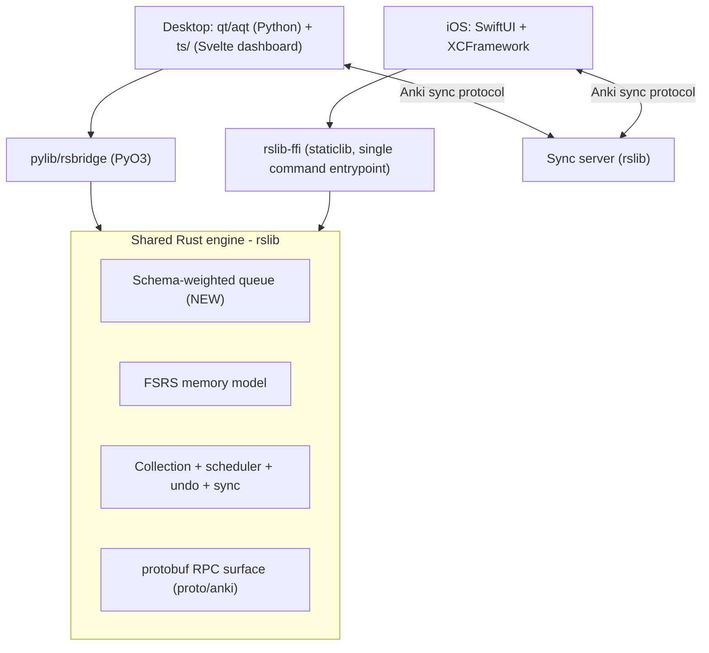

# Architecture — Speedrun LSAT

This document explains how the desktop app and the iOS companion share **one** Anki Rust engine, and how the new schema-weighted queue, the three scores, sync, and the conflict rule fit together. It complements [../PRD.md](../PRD.md).

## 1. One engine, two front ends



**The invariant:** there is exactly one implementation of the scheduler, FSRS, the collection format, sync, and the schema-weighted queue — in `rslib`. Both front ends reach it through a **protobuf command entrypoint**, never by re-implementing logic.

## 2. The protobuf command pattern (and why iOS reuses it)

Anki already routes all backend calls as protobuf messages:

- `.proto` files in `proto/anki/` define services, methods, and message types.
- The build generates Rust dispatch + Python/TS stubs.
- `pylib/rsbridge` (PyO3) exposes a single bridge into Rust; `pylib/anki/_backend.py` provides a snake_case method per RPC that encodes a request message, calls the bridge, and decodes the response.

The iOS bridge mirrors this exactly:

```
// rslib-ffi (conceptual)
run_command(service: u32, method: u32, input: &[u8]) -> Vec<u8>   // protobuf bytes in/out
```

Swift encodes the same protobuf request, calls `run_command`, and decodes the response. Because both front ends speak the same protobuf surface to the same Rust `Backend`, the schema-weighted queue and all three scores behave identically on desktop and phone — and a future Anki rebase only has to reconcile the Rust side.

## 3. Build/runtime layout (`ankitects/anki`, branch `main`)

| Path                     | Role                           | Our changes                                                          |
| ------------------------ | ------------------------------ | -------------------------------------------------------------------- |
| `rslib/`                 | Core Rust backend              | schema-weighted queue; weakness/priority math; (later) mastery query |
| `proto/anki/`            | protobuf definitions           | new message(s) + RPC for the queue                                   |
| `pylib/rsbridge/`        | PyO3 bridge                    | unchanged (reused)                                                   |
| `pylib/anki/_backend.py` | snake_case RPC methods         | new method auto-exposed for the queue RPC                            |
| `qt/aqt/`, `ts/`         | Desktop GUI + Svelte dashboard | review loop wiring + three-score dashboard                           |
| `rslib-ffi/` (new crate) | iOS staticlib bridge           | single command entrypoint → XCFramework                              |
| `build/`, `justfile`     | Build system (ninja + uv)      | `just bench`, iOS build recipe                                       |

Build commands: `just run` (build + launch desktop), `just check` (Rust + Python tests), `just --list` (all recipes). Develop in a **path with no spaces** — Anki's build fails otherwise.

## 4. iOS engine packaging

1. Add `rslib-ffi` crate with `crate-type = ["staticlib"]` wrapping `rslib::backend::Backend`.
2. Generate Swift bindings with **UniFFI** (or a `cbindgen` C header for the single entrypoint).
3. Build for `aarch64-apple-ios` and a simulator target (`aarch64-apple-ios-sim` on Apple silicon).
4. `xcodebuild -create-xcframework` → bundle `.a` + headers into an **XCFramework** consumed by the SwiftUI app.

Reference structure: `ianthetechie/uniffi-starter` (Rust core + Swift package + `build-ios.sh` producing the XCFramework). Re-run the build whenever Rust changes.

## 5. Sync and the conflict rule

- **Transport:** Anki's existing sync protocol against a sync server built from `rslib` (self-hosted in development). Desktop and iOS both sync against it.
- **Offline-first:** iOS reviews offline; queues changes; syncs on reconnect. Tolerates mid-sync disconnect and a wrong device clock without corruption or double-counting.
- **Conflict rule:** if the same card is reviewed on two devices offline, the **later real timestamp wins** the card's scheduling state; the losing review is retained in revlog history but does not double-count scheduling. This is deterministic and documented so a grader can re-run the sync test and see the same winner.

## 6. AI integration (off by default until Friday)

AI lives behind an interface with a hard off-switch; the engine and all three scores work with AI disabled. AI never mutates the collection format — it produces candidate items (checked against the gold set before insertion) and reasoning-evaluation feedback (advisory). Source text is sanitized to resist prompt injection. See [../PRD.md §14](../PRD.md#14-ai-features-sourced-evaluated-switch-off-able).

## 7. Failure-mode handling (what we are graded against breaking)

| Adversarial case                                | Where handled                                                      |
| ----------------------------------------------- | ------------------------------------------------------------------ |
| Memorizes wording, fails reworded items         | Performance model + paraphrase test (recall ≠ transfer)            |
| Huge deck skipping a high-weight topic          | Coverage map → readiness abstains                                  |
| Two cards stating opposite facts                | Schema tagging review + checker                                    |
| Hidden text in a source file (prompt injection) | Source sanitization in AI ingestion                                |
| Taps "Good" without reading                     | Latency outliers flagged; suspiciously fast attempts down-weighted |
| Topic with almost no history                    | Give-up rule per schema; wide range / abstain                      |
| Accurate but too slow                           | Latency-aware readiness flags the imbalance (SPOV4)                |
| AI offline / rate-limited / broken output       | AI-off path; both apps keep scoring                                |
| Same card reviewed on two devices offline       | Conflict rule (later timestamp wins)                               |
| Crash mid-review                                | Atomic collection writes; crash test shows zero corruption         |
